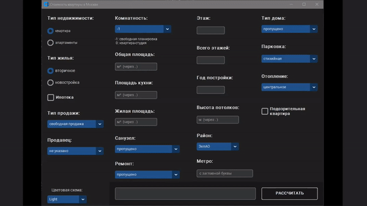

# Оценка стоимости картиры в Москве

## 1. Цель проекта:

построение модели регрессии цены квартиры в Москве на основании данных c сайта по поиску
недвижимости [Циан](https://www.cian.ru/).

Для этого необходимо спарсить данные с сайта, провести их статистический анализ, выявить закономерности в них,
обработать и подготовить данные для моделирования, построить модели регрессии. Будут рассмотрены 5 наиболее популярных
моделей для решения задачи регрессии: Elastic Net, Ridge Regression, Lasso Regression, Random Forest и Gradient Boosted
Trees. В итоге по результам тестирования будет выбрана наиболлее эффективная модель-победитель.

## 2. Структура проекта:

1. Сбор данных:
    - [Парсер объявлений о прадаже квартир](application/parsers/main_page_parser.py)
    - [Парсер данных из каждого объявления](application/parsers/ad_page_parser.py)
2. Машинное обучение:
    - **2.1**: [Разведывательный анализ данных](application/eda.ipynb)
    - **2.2**: [Очистка данных](application/data_cleaning.ipynb)
    - **2.3**: [Инжиниринг признаков](application/feature_engineering.ipynb)
    - **2.4**: [Обучение моделей](application/model_training.ipynb)

При реализации проекта использовались следующие библиотеки:
* beautifulsoup4
* fake-useragent
* lxml
* requests
* selenium
* pandas
* numpy
* matplotlib
* seaborn
* sklearn
* missingno
* customtkinter

## 3. Данные

Данные получены при помощи парсера, написанного с использованием библиотек BeautifulSoup, fake_useragent, selenium.
Датасет имеет 89184 объектов и 36 признаков.

### Признаки :

* flat_type - тип недвижимости (квартира, апартаменты)
* rooms - количество комнат (студия, 1-6 комнат, свободная планировка)
* price - цена (целевая переменная)
* sale_type - тип продажи (свободная, альтернатива, долевое участие (214-фз))
* mortgage - возможность ипотеки
* area - общая площадь квартиры (кв.м)
* living_area - жилая площадь (кв.м)
* kitchen_area - площадь кухни (кв.м)
* floor - этаж
* floors - всего этажей
* built_year - год постройки
* address - адрес
* district - городской округ
* metro_station - станция метро
* seller - продавец (собственник, агенство, застройщик, частный реидтор, консультант)
* housing_type - тип жилья (вторичное, новостройка)
* planning - планировка (изолированная, смежная, смежно-изолированная)
* ceiling_height - высота потолков (м)
* bathroom - санузел
* balcony_loggia - лоджия/балкон
* repair - ремонт (без ремонта, евроремонт, косметический, дизайнерский)
* view - вид из окон (во двор, на улицу, на улицу и двор)
* finished_shell_condition - отделка (чистовая, черновая, предчистовая)
* house_type - тип дома, который характеризует материал несущих стен (кирпичный, монолитный, панельный, блочный,
  деревянный, монолитно-кирпичный, сталинский)
* house_class - класс дома (бизнес, экономб премиум, комфорт)
* building_number - количество корпусов в доме
* parking - парковка
* elevators - лифты
* housing_line - серия дома
* floor_type - материал перекрытий
* entrance_number - количество подъездов в доме
* heating - отопление
* unsafe_house - аварийность дома
* garbage_disposal - мусоропровод
* gas_supply - газоснабжение
* description_text - текст объявления
* is_suspicious - подозрительность квартиры (некоторые квартиры на сайте отмечены как подозрительные)

### Данные после очистки

После очистки число признаков сократилось до 23, объектов - до 81856. Были обработаны выбросы и пропущенные данные. Для
некоторых числовых признаков, имеющих пропущенные значения, с сильной положительной корреляциейс признаками без
пропусков была проведена импутация данных при помощи линейной регрессии. Для инжиниринга признаков использовалось прямое
кодирование (One-Hot encoding).

## 4. Результаты

Были обучены и протестированы 5 моделей: Elastic Net, Ridge Regression, Lasso Regression, Random Forest и Gradient
Boosted Trees. В качестве метрик качества использовались MAE (mean absolute error) и R2. Наименьшее значение
MAE и наибольшее значение R2 имеет один и то же алгоритм - **Random Forest**.

Для более удобного использования обученной модели был
создан [графический интерфейс пользователя](application/graphical_user_interface.py) с использованием библиотеки
customtkinter.

